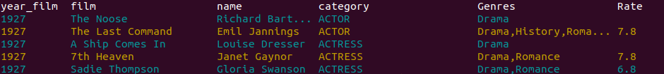
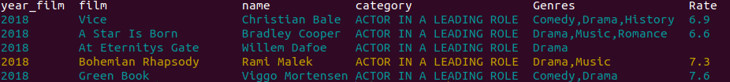
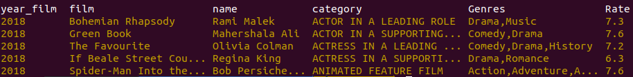
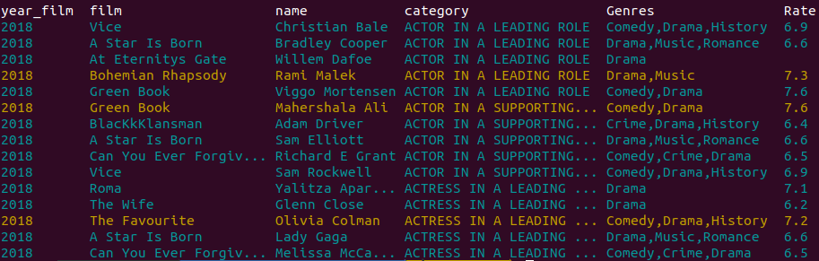

# Oscars

<p>Partimos de un dataframe todas las nominaciones de los Oscars: https://www.kaggle.com/unanimad/the-oscar-award. Hay que tener en cuenta que hay nominaciones que no se hacen a una pelicula en concreto y estos campos aparecen vacios.</p>

<p>Lo enriquecemos a traves de la API de TheMovieDB cogiendo los campos Genres y la url del poster de la película. Además, haciendo web scrapping a Filmaffinity cogemos la valoración y descriptición de la pelicua.</p>

<p>Creamos una función para que nos devuelva estas nominaciones según una serie de filtros</p>

## Parámetros de la función main

<p>En la función main tiene siete parámetros:</p>
<p>Los dos primeros que vamos a explicar tiene información de cómo se cargan los datos. En el proyecto hay un json de datos precargados de la API de TheMovieDB y de filmaffinity, así que si dejamos no indicamos nada en esos camops se cogeran los datos de los json precargados.</p>
<ul>
<li>-fa: "y" Hará que se conecte con Filmaffinity y actualice los datos por web scraping.</li>
<li>-tm: "y" Hará que se conecte con TheMovieDB y actualice los datos (Necesario API KEY).</li>
</ul>
<p>Asi la función loads_oscar_final se encarga de coger esos datos y crear un único dataframe con las columnas del csv más las dos que hemos indicado de Filmaffinity y TheMovieDB</p>
<ul>
<li>-g Filtra por genero siendo los valores permitidos: Action','Adventure','Animation','Comedy','Crime','Documentary','Drama','Family','Fantasy','History','Horror','Music','Mystery','Romance','Science Fiction','TV Movie','Thriller','War','Western'.
```sh
$ python3 main.py -g Comedia 
```

</li>

<li>-y Fitra por año desde el 1921-2019.
```sh
$ python3 main.py -y 2018 
```

</li>
<li>-w Filtra por ganadores: y o nominados: n.
```sh
$ python3 python3 main.py -y 2018 -w y 
```

</li>
<li>-n Mostrará los n primeros valores que coincidan con los campos de busqueda.
```sh
$ python3 main.py -y 2018 -n 15 
```

</li>
</ul>

<p>La inforamción de las peliculas aplicados los filtros también se muestra en un pdf que se guarda en fichero del proyecto.</p>


    